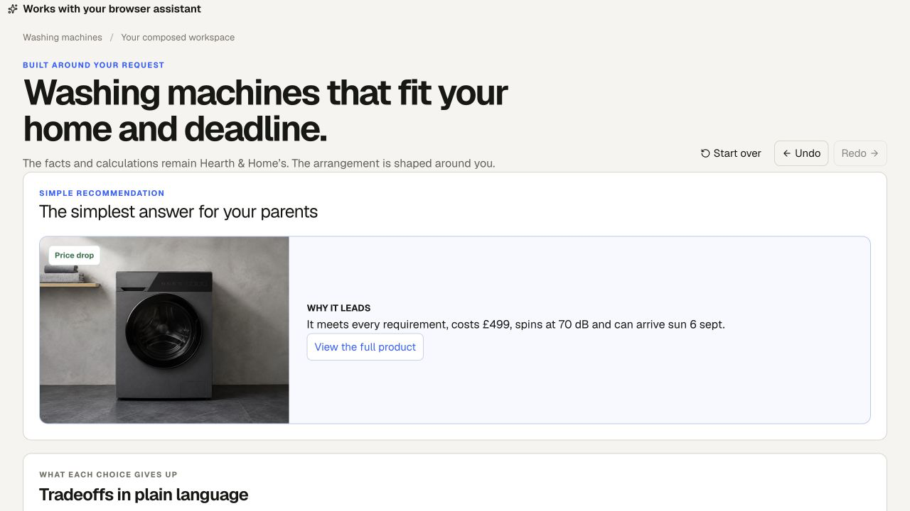
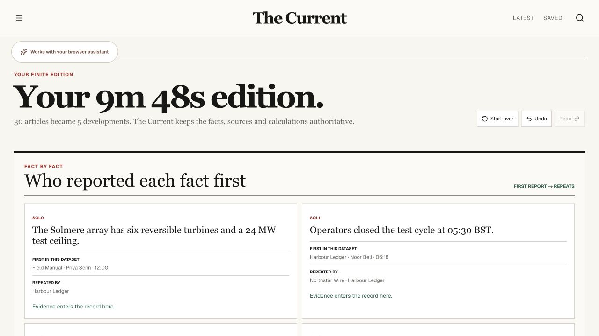

# The You-Shaped Web

**The page becomes the interface you need.**

[Explore the live showcase](https://you-shaped-web.carry-protocol.workers.dev/showcase)


Three ordinary websites. One sentence. Countless useful interfaces, assembled around the person using them.

The You-Shaped Web explores a different interaction model for the web. A browser assistant asks a cooperating webpage to compose the interface a person needs. The website keeps authority over its records, verified facts, calculations, and supported actions. The assistant chooses which native pieces—questions, tables, charts, timelines, comparisons, provenance, and more—to arrange.

The result stays on the webpage. A person can edit, save, pin, hide, compare, or lock choices directly, then ask for a completely different arrangement without losing the decisions that still matter.

## Three websites, many interfaces

### Hearth & Home

From product grid to whatever decision tool this shopper needs.

| Ordinary catalog                                                                                  | Composed decision workspace                                                                                 |
| ------------------------------------------------------------------------------------------------- | ----------------------------------------------------------------------------------------------------------- |
|  |  |

A conventional 28-product catalog can become a fit-and-cost workspace, a compact table, a price-versus-noise chart, a delivery calendar, or a simple recommendation. In the canonical decision, **9 of 28** machines qualify. The Elmridge E8 Eco’s **£1,081.40** eight-year total opens into exact purchase, energy, and water arithmetic.



### Wayline

From advertised durations to timelines, stress tests, and complete journeys.

| Ordinary search results                                                    | Complete-journey composition                                                                         |
| -------------------------------------------------------------------------- | ---------------------------------------------------------------------------------------------------- |
|  |  |

Wayline can rebuild 18 search results around the whole trip. **18 results become 7 complete journeys**, and AeroSwift AS 104’s advertised **1h 10m becomes 4h 26m door to door**. A follow-up can replace the ranking with a disruption-aware timeline while retaining the person’s saved train and luggage lock.


### The Current

From an endless feed to editions, event timelines, and source maps.

| Ordinary news homepage                                                                  | Finite edition                                                                             |
| --------------------------------------------------------------------------------------- | ------------------------------------------------------------------------------------------ |
|  |  |

The Current can collapse 30 overlapping articles into **5 distinct developments totaling 9m 48s**, while keeping original reporting, repeated coverage, and verified facts inspectable. The same material can become a chronological event timeline or a provenance map.



## Ask, edit, ask again

The assistant composes the interface. The website performs the calculations and renders its own components. The person then edits the result directly. A later request reads the current page and recomposes it without discarding relevant saves, pins, hidden items, requirements, or locks.

**Ask → page composes → person edits → ask again → page recomposes without losing the person’s choices.**

These are not prepared whole-page presets. Follow-ups can add, remove, move, and reconfigure independent native components while the page remains in place.

## Try it

- [Hearth & Home](https://you-shaped-web.carry-protocol.workers.dev/) · [clean start](https://you-shaped-web.carry-protocol.workers.dev/?fresh=1)
- [Wayline](https://you-shaped-web.carry-protocol.workers.dev/journeys) · [clean start](https://you-shaped-web.carry-protocol.workers.dev/journeys?fresh=1)
- [The Current](https://you-shaped-web.carry-protocol.workers.dev/edition) · [clean start](https://you-shaped-web.carry-protocol.workers.dev/edition?fresh=1)
- [Project showcase](https://you-shaped-web.carry-protocol.workers.dev/showcase)

Use ChatGPT’s browser assistant on one of the clean-start pages and try a request below.

### Hearth & Home prompts

> Turn this catalog into a decision workspace for a renter with a shallow alcove. Begin with the questions I still need to answer, then show a shortlist, a cost-versus-noise chart, and a comparison.

> I measured it: 58 cm deep. Remove the questions, make the remaining products a compact table, and put the quietest machine below £550 first.

> Replace the table with a simple recommendation for my parents. Show what they sacrifice with each alternative and add a delivery calendar.

### Wayline prompts

> Build a complete door-to-door timeline. Separate travel, waiting, terminal buffers, walking, and luggage time.

> Turn this into a delay stress test. Show what happens to every arrival after a 20-minute disruption.

> Now make it a simple day plan containing only step-free options that reach De Pijp before 7pm.

### The Current prompts

> Give me a finite ten-minute edition. Merge repeated coverage, preserve original reporting, and put genuinely new developments first.

> Replace the edition with a chronological timeline of the tidal-energy story. Include only moments when a new verified fact appeared.

> Turn the timeline into a provenance map showing who reported each fact first, which publications repeated it, and where the evidence changed.

## Why WebMCP

A chat answer leaves the useful result in chat, while click automation remains constrained to the page’s existing controls. WebMCP lets the assistant ask the page itself to compose a new native interface.

The page resolves every factual claim, record ID, rule, and calculation. The assistant supplies the person’s goal and the arrangement—not invented product specifications, journey times, article summaries, formulas, or arbitrary markup. That boundary makes the result both flexible and trustworthy.

## Human and assistant, in one loop

The assistant handles interface composition. The website handles truth. The person keeps agency. Direct edits recompute immediately, and saves, pins, hidden choices, and locks survive later assistant requests whenever they remain relevant. Exact calculations, exclusions, provenance, and zero-result recovery stay available on the page.

## Implementation

The project uses React, TypeScript, Vinext, and WebMCP. Each route exposes deterministic first-party records, calculations, safe state operations, and a registry of native components. Composition inputs are validated; arbitrary HTML, CSS, scripts, URLs, and factual claims are not accepted. Route state persists locally with revision-aware undo and redo. The public deployment runs on Cloudflare through Wrangler.

## Run locally

Requirements: Node.js 22.13 or newer.

```bash
npm install
npm run dev
```

Then open `http://localhost:3000`.

Validation commands:

```bash
npm run lint
npx tsc --noEmit
npm run build
```

## Fictional demonstration data

All brands, products, journeys, operators, publications, reporters, people, and events in this project are fictional demonstration data. The fictional product and editorial images were generated for this project and are stored locally in the repository.

## Links

- [Live showcase](https://you-shaped-web.carry-protocol.workers.dev/showcase)
- [Public repository](https://github.com/ely2ba/you-shaped-web)

## License

[MIT](LICENSE)
