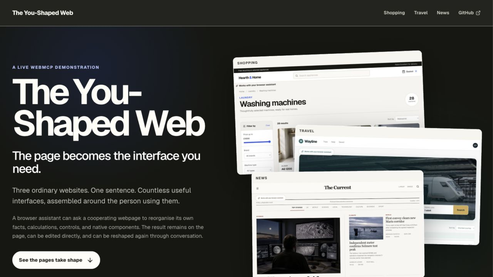
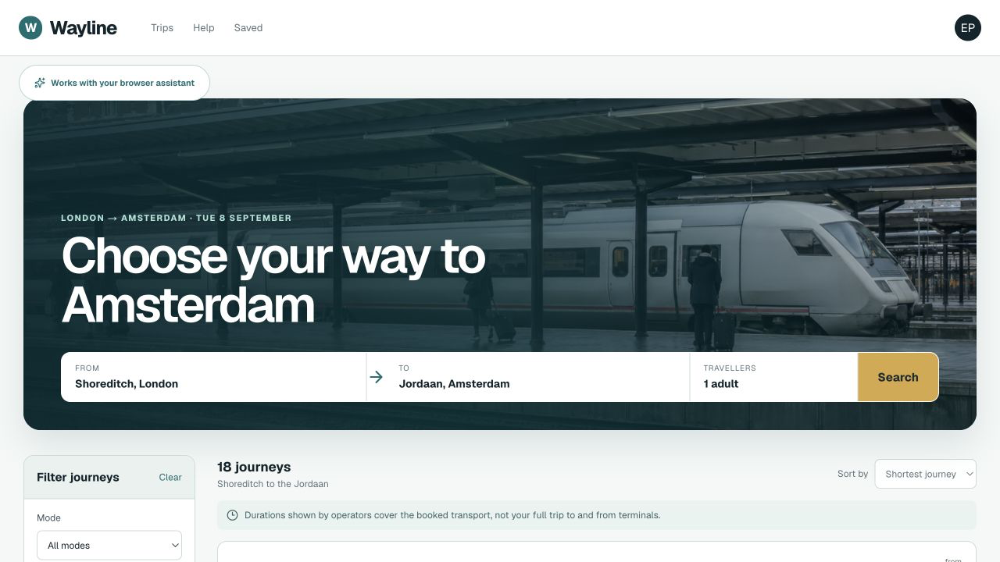
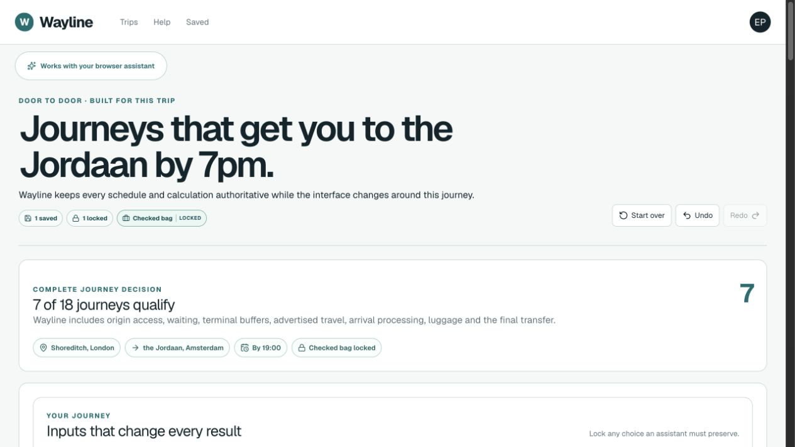
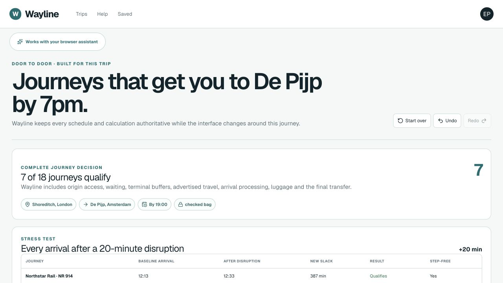
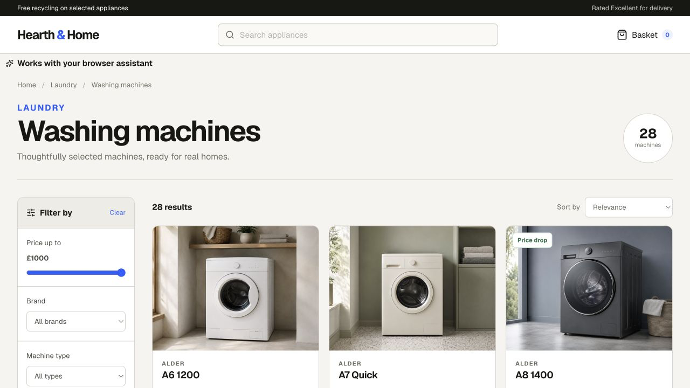
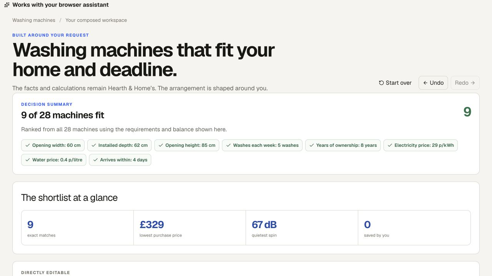
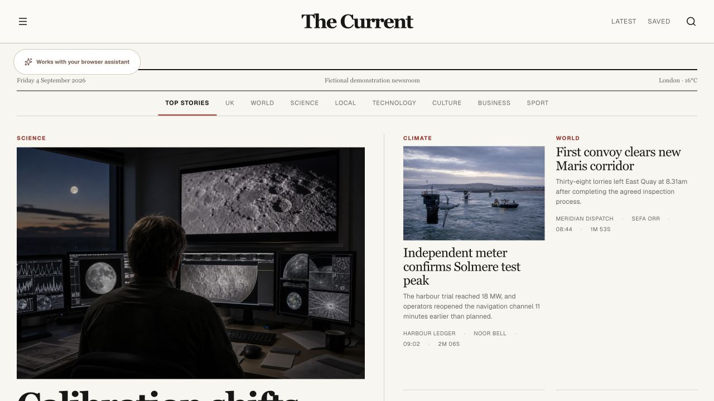
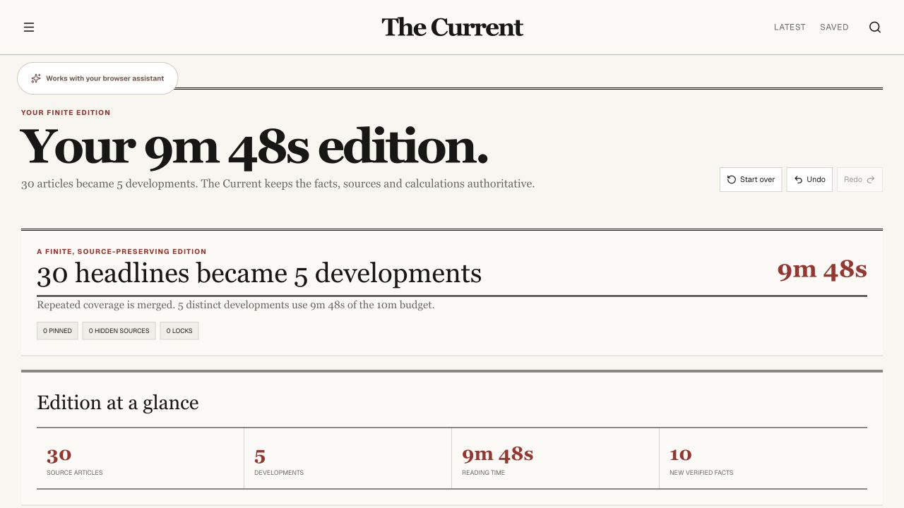

# Morph

**Web interfaces no longer have to be designed around every possible task in advance.**

[Try Wayline](https://morph.carry-protocol.workers.dev/journeys?fresh=1) · [Explore the live showcase](https://morph.carry-protocol.workers.dev/showcase)



Most travel sites rank a journey by the time spent on the advertised train or flight. A traveler actually needs to know when to leave home, how much walking and waiting is involved, whether luggage breaks a connection, and when they will reach the final address.

Morph lets the traveler say that in one sentence. The cooperating website then composes a native interface around the decision while keeping control of its own records, calculations, and supported actions.

## The hero story: the whole journey

| Ordinary travel results | Interface composed for the decision |
| --- | --- |
|  |  |

Wayline begins as an ordinary page of 18 search results. Ask it to rank the complete journey and **18 results become 7 viable journeys**. AeroSwift AS 104's advertised **1h 10m becomes 4h 26m door to door**, with the walking, waiting, terminal buffer, transfer, and luggage arithmetic visible on the page.

The more important interaction comes next. The traveler saves a train and locks the checked-luggage choice by hand, then asks for a disruption-aware timeline. The entire page recomposes around the new task while those human decisions survive.



That continuing loop is Morph:

**Ask → page composes → person edits → ask again → page recomposes without losing the person's choices.**

## A different contract for the web

A traditional website requires its developer to anticipate every task:

`developer predicts task → developer builds interface → person adapts to interface`

Morph changes that relationship:

`website exposes truth + capabilities + native components → person states goal → assistant composes interface`

The assistant does not generate arbitrary markup or invent answers. It selects and arranges components the website provides. The website continues to decide what is true, what can be calculated, and which actions are valid. The person can then save, pin, hide, compare, edit, or lock choices directly.

| Participant | Authority |
| --- | --- |
| **Assistant** | Composition |
| **Website** | Truth |
| **Human** | Final authority |

This is more than personalized UI. The useful interface does not need to have been predicted and built as a complete screen beforehand, yet it remains a real part of the website: interactive, inspectable, persistent, and bounded by first-party data.

## One model, three everyday problems

Wayline is the main demonstration. Hearth & Home and The Current show that the interaction model generalizes beyond travel.

| Experience | What the ordinary page shows | What the person actually needs |
| --- | --- | --- |
| **Wayline** | 18 journeys and an advertised **1h 10m** duration | 7 viable choices and the real **4h 26m** door-to-door journey |
| **Hearth & Home** | 28 washing machines | 9 machines that actually fit the home, budget, delivery window, and ownership needs |
| **The Current** | 30 overlapping articles | 5 distinct developments that fit into **9m 48s** |

### Hearth & Home

| Ordinary product catalog | Composed decision workspace |
| --- | --- |
|  |  |

A product grid can become a fit-and-cost workspace, compact comparison, price-versus-noise chart, delivery calendar, or recommendation. In the example above, **9 of 28** machines satisfy every requirement. The Elmridge E8 Eco's **£1,081.40** eight-year total opens into the exact purchase, energy, and water arithmetic computed by the retailer.

### The Current

| Ordinary news homepage | Finite edition |
| --- | --- |
|  |  |

An endless feed becomes **5 distinct developments totaling 9m 48s**. Duplicate coverage is merged, original reporting remains visible, and every verified fact can be traced to its source. The same material can become an event timeline or provenance map.

## Why WebMCP

A chat answer takes the result away from the website. Click automation can operate only the controls the developer already anticipated. WebMCP lets an assistant ask a cooperating page to compose a new interface from first-party capabilities.

Every Morph experience exposes its complete site-owned records, calculations, allowed actions, and native component vocabulary. The assistant supplies the person's goal and arrangement. The site resolves every record ID, rule, eligibility decision, formula, and displayed value, then renders the result with its own components.

These are not prepared whole-page presets. Components can be added, removed, moved, grouped, sorted, and reconfigured independently. Every tool call visibly changes the webpage, and follow-up calls read the current interface before changing it.

## Try the collaboration loop

Open [Wayline from a clean start](https://morph.carry-protocol.workers.dev/journeys?fresh=1) with ChatGPT's browser assistant.

> Build a complete door-to-door timeline. Separate travel, waiting, terminal buffers, walking, and luggage time.

On the resulting page, save a train and lock checked luggage. Then ask:

> Turn this into a delay stress test. Show what happens to every arrival after a 20-minute disruption.

The layout and decision model change; the person's saved journey and luggage lock remain.

For the two short generalization proofs:

- [Hearth & Home](https://morph.carry-protocol.workers.dev/?fresh=1): “Turn this catalog into a decision workspace for a renter with a shallow alcove. Begin with the questions I still need to answer, then show a shortlist, a cost-versus-noise chart, and a comparison.”
- [The Current](https://morph.carry-protocol.workers.dev/edition?fresh=1): “Give me a finite ten-minute edition. Merge repeated coverage, preserve original reporting, and put genuinely new developments first.”

## Implementation

Morph uses React, TypeScript, Vinext, and WebMCP. Each route contains deterministic first-party records and calculations, safe state operations, and a registry of native components. Composition inputs are validated; arbitrary HTML, CSS, scripts, URLs, and factual claims are rejected. Human edits persist locally with revision-aware undo and redo. The public deployment runs on Cloudflare.

## Run locally

Requires Node.js 22.13 or newer.

```bash
npm install
npm run dev
```

Then open `http://localhost:3000`.

```bash
npm run lint
npx tsc --noEmit
npm run build
```

## Demonstration data

All brands, products, journeys, operators, publications, reporters, people, and events are fictional demonstration data. Product and editorial images created for the project are stored locally in the repository.

## Links

- [Live showcase](https://morph.carry-protocol.workers.dev/showcase)
- [Public repository](https://github.com/ely2ba/morph)

## License

[MIT](LICENSE)
