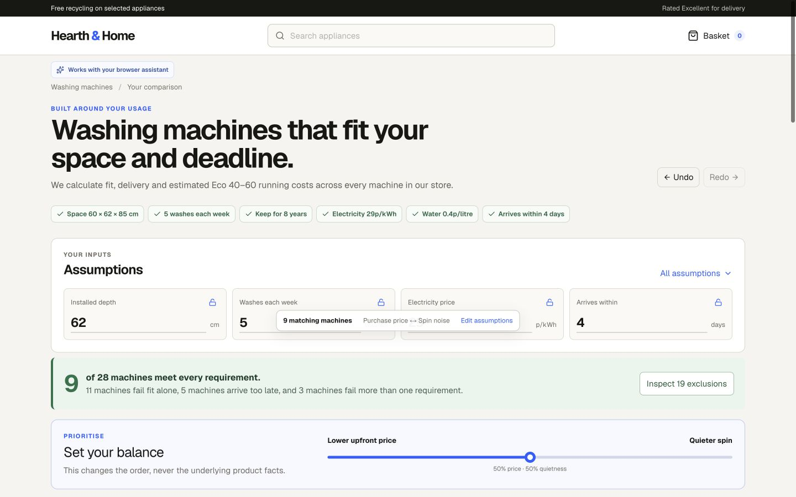
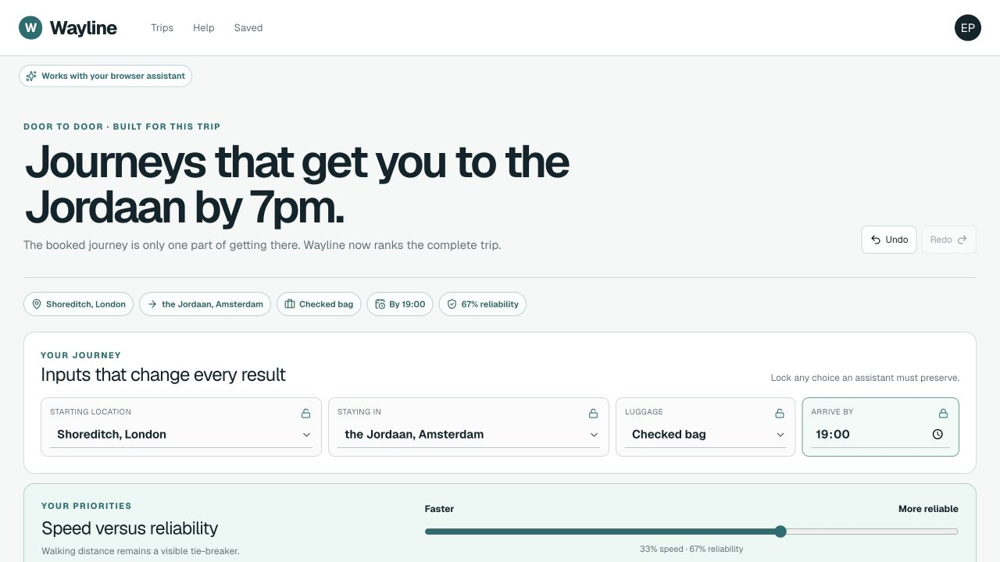
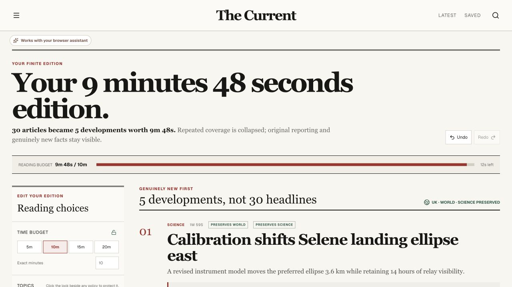

# WebMCP decision interfaces

This submission demonstrates one reusable product pattern:

> WebMCP lets any page expose the facts and safe operations needed to become the interface a particular person needs.

Each route begins as a credible conventional website. A real WebMCP request can then create a persistent, directly editable decision interface using only deterministic facts, calculations, and operations owned by the page.

## Live experiences

- [Hearth & Home washer decision tool](https://hearth-home-washer-decision.xflingoo.chatgpt.site/) — primary submission demo
- [Wayline journey decision tool](https://hearth-home-washer-decision.xflingoo.chatgpt.site/journeys)
- [The Current finite news edition](https://hearth-home-washer-decision.xflingoo.chatgpt.site/edition)

All brands, products, schedules, operators, publications, reporters, events, and newsroom facts are fictional demonstration data.

## Screenshots

### Hearth & Home



[Mobile screenshot](./public/demo/hearth-home-transformed-mobile.png)

### Wayline



[Ordinary results](./public/demo/wayline-ordinary.png) · [door-to-door plot](./public/demo/wayline-plot.png) · [calculation drawer](./public/demo/wayline-explanation.png) · [mobile](./public/demo/wayline-transformed-mobile.png)

### The Current



[Ordinary homepage](./public/demo/the-current-ordinary.png) · [six-minute direct edit](./public/demo/the-current-direct-edit.png) · [selection explanation](./public/demo/the-current-explanation.png) · [mobile](./public/demo/the-current-transformed-mobile.png)

## Demo clips

- [Final six-second montage](./public/demo/webmcp-final-montage.mp4)
- [Wayline 25-second proof](./public/demo/wayline-proof.mp4)
- [The Current 25-second proof](./public/demo/the-current-proof.mp4)

The montage uses the required voiceover verbatim:

> The same pattern turns travel results into the journey comparison you actually need, and an endless news feed into a finite, source-preserving edition. The page becomes the interface you need.

## Canonical requests

Wayline:

> I’m leaving from Shoreditch and staying in Amsterdam’s Jordaan. Rank these by total door-to-door time, walking distance, and missed-connection risk. I care twice as much about reliability as speed, have a checked bag, and need to arrive by 7pm. Ignore lounge access.

The Current:

> Give me a finite ten-minute edition. Merge duplicate coverage, preserve original reporting, and put genuinely new developments first. Keep at least one UK story, one world story, and one science story. Skip sport and celebrity.

## WebMCP contracts

Hearth & Home exposes its existing five washer tools. Wayline registers only `read_page`, `create_journey_view`, `update_journey_view`, `compare_journeys`, and `show_journey_calculation`. The Current registers only `read_page`, `create_edition`, `update_edition`, `compare_coverage`, and `show_selection_reason`.

The pages own every fact, enum, eligibility rule, ranking, calculation, and rendered component. Tool inputs cannot supply HTML, arbitrary URLs, formulas, summaries, or claims. Revisions prevent stale writes; reader locks, saved or pinned choices, hidden items and sources, comparisons, undo/redo history, and local persistence survive later agent calls. Direct controls recompute without another model call. Derived values open into their exact inputs and arithmetic, and impossible requests preserve requirements while offering computed relaxations.

The canonical Wayline state returns 7 eligible journeys from 18 and exposes the exact `35 + 85 + 70 + 15 + 30 + 31 = 266 minutes` calculation behind the reveal “1h 10m in search becomes 4h 26m door to door.” The canonical Current state reduces 30 articles in 10 story clusters to 5 developments totaling 588 seconds, with the visible reveal “30 articles became 5 developments worth 9m 48s.”

## Run and validate locally

```bash
npm install
npm run dev
npm run lint
npx tsc --noEmit
npm run build
```

## Generated editorial photography

The following raster assets were created with OpenAI image generation, then stored locally so the deployed experiences do not depend on third-party image URLs. The prompts explicitly prohibit logos, readable text, watermarks, and pseudo-text.

<details>
<summary><code>public/journeys/amsterdam-rail-platforms.png</code></summary>

Source output: `/Users/elyb/.codex/generated_images/01a06a7b-91a7-7881-be55-91527d277ee2/exec-df790f01-4c57-46b3-94b0-f67893e14911.png`

```text
Use case: photorealistic-natural
Asset type: wide 3:2 editorial website image for a European journey-planning page
Primary request: A documentary-style daylight photograph looking across the open-air rail platforms at Amsterdam Centraal toward a clean, completely unbranded modern European intercity train. A few anonymous travellers with small rolling luggage wait or walk naturally on the platform.
Scene/backdrop: Recognizably Dutch urban railway setting at Amsterdam Centraal, viewed across parallel tracks and platform canopies; keep all wayfinding, posters, boards, and train markings outside the frame, blank, obscured, or too soft to read.
Subject: The unbranded intercity train and understated human activity of travel; no one faces the camera prominently.
Style/medium: Photorealistic contemporary editorial photography, candid documentary realism, subtle filmic color, natural detail and texture, not glossy advertising.
Composition/framing: Wide horizontal 3:2 frame, eye-level view across the platforms, layered rails and canopy lines, balanced editorial composition with no empty headline overlay area required.
Lighting/mood: Realistic overcast Dutch daylight, soft diffuse shadows, calm practical travel mood.
Color palette: Muted steel, concrete, cool grey sky, restrained natural clothing colors.
Materials/textures: Authentic rail steel, weathered platform paving, glass, painted metal, slight dampness in the air.
Text (verbatim): none.
Constraints: No visible operator marks, no train livery branding, no logos, no readable station signs, no legible departure boards, no advertising, no captions, no watermarks, no invented lettering or pseudo-text anywhere in the image.
Avoid: Landmark-postcard stylization, dramatic cinematic spectacle, crowds, posed models, distorted train geometry, fantasy infrastructure, oversaturation, HDR look, illustration, CGI.
```

</details>

<details>
<summary><code>public/edition/lunar-observation-control-room.png</code></summary>

Source output: `/Users/elyb/.codex/generated_images/01a06a7b-91a7-7881-be55-91527d277ee2/exec-da1789a6-2fc6-4f0e-a878-55453bef6583.png`

```text
Use case: photorealistic-natural
Asset type: wide 3:2 restrained science-news editorial website image
Primary request: A sober documentary photograph inside a moon-observation control room at dusk. One anonymous researcher is seen only from behind, seated or standing in quiet concentration while studying detailed lunar imagery on several deliberately unreadable abstract displays.
Scene/backdrop: A credible contemporary scientific observation and analysis room with modest equipment, subdued work surfaces, monitor glow, and a dusk-darkened window or ambient evening light.
Subject: The researcher from behind and the moon imagery as scientific material; displays may show cratered lunar terrain, grayscale orbital mosaics, and abstract plots, but every interface element must be nonverbal and unreadable.
Style/medium: Photorealistic restrained science-news editorial photography, natural documentary realism, sober and credible, not a science-fiction movie set.
Composition/framing: Wide horizontal 3:2 frame, over-the-shoulder room view with the researcher modestly scaled, layered monitors and soft negative space, natural perspective.
Lighting/mood: Soft indigo dusk light mixed with low neutral monitor illumination; thoughtful, quiet, serious mood; controlled highlights.
Color palette: Indigo, charcoal, muted grey, cool white lunar surfaces, subtle natural skin and fabric tones.
Materials/textures: Matte workstation surfaces, realistic glass reflections, softly worn equipment, convincing photographic grain.
Text (verbatim): none.
Constraints: Researcher must remain anonymous with face fully unseen. No logos, no institution marks, no mission patches, no legible words, letters, numbers, UI labels, captions, signage, watermarks, or invented pseudo-text anywhere. All screens use purely abstract, deliberately unreadable visual content.
Avoid: Futuristic spaceship aesthetics, holograms, neon cyberpunk lighting, dramatic action, heroic posing, glossy corporate advertising, oversaturation, illustration, CGI, distorted hands or equipment.
```

</details>

<details>
<summary><code>public/edition/tidal-energy-harbour.png</code></summary>

Source output: `/Users/elyb/.codex/generated_images/01a06a7b-91a7-7881-be55-91527d277ee2/exec-f65ac1c5-cb95-434d-bdff-cd26e28ae744.png`

```text
Use case: photorealistic-natural
Asset type: wide 3:2 restrained local-climate-news editorial website image
Primary request: A documentary photograph of a tidal-energy installation in coastal water just outside a British harbour at grey-blue dawn. Several practical marine turbines form the installation while a small maintenance vessel works nearby.
Scene/backdrop: A believable working British harbour approach with low breakwater, distant modest coastal buildings and headland silhouettes, tidal current visible in the water, cool dawn cloud cover.
Subject: The real-world tidal turbines and the maintenance vessel; functional renewable-energy infrastructure shown at human scale, with no branding.
Style/medium: Photorealistic local-news documentary photography, restrained and observational, authentic maritime weather, not promotional concept art.
Composition/framing: Wide horizontal 3:2 frame from shore or a low harbour vantage, turbines and maintenance vessel clearly readable as the main story, layered sea and harbour background, natural lens perspective.
Lighting/mood: Grey-blue dawn, diffused early light through overcast cloud, faint horizon brightness, sober working atmosphere.
Color palette: Slate blue water, cool greys, muted metal, subdued safety colors used sparingly.
Materials/textures: Choppy tidal water, salt-weathered metal, wet deck surfaces, sea haze, realistic vessel wake.
Text (verbatim): none.
Constraints: No logos, no vessel names, no operator marks, no flags with identifiable symbols, no legible registration numbers, no signage, no captions, no advertising, no watermarks, and no invented lettering or pseudo-text anywhere.
Avoid: Wind turbines, fantasy devices, giant sci-fi machinery, pristine product-render appearance, dramatic storm disaster imagery, tropical coast, sunset orange, crowds, oversaturation, HDR, illustration, CGI.
```

</details>
